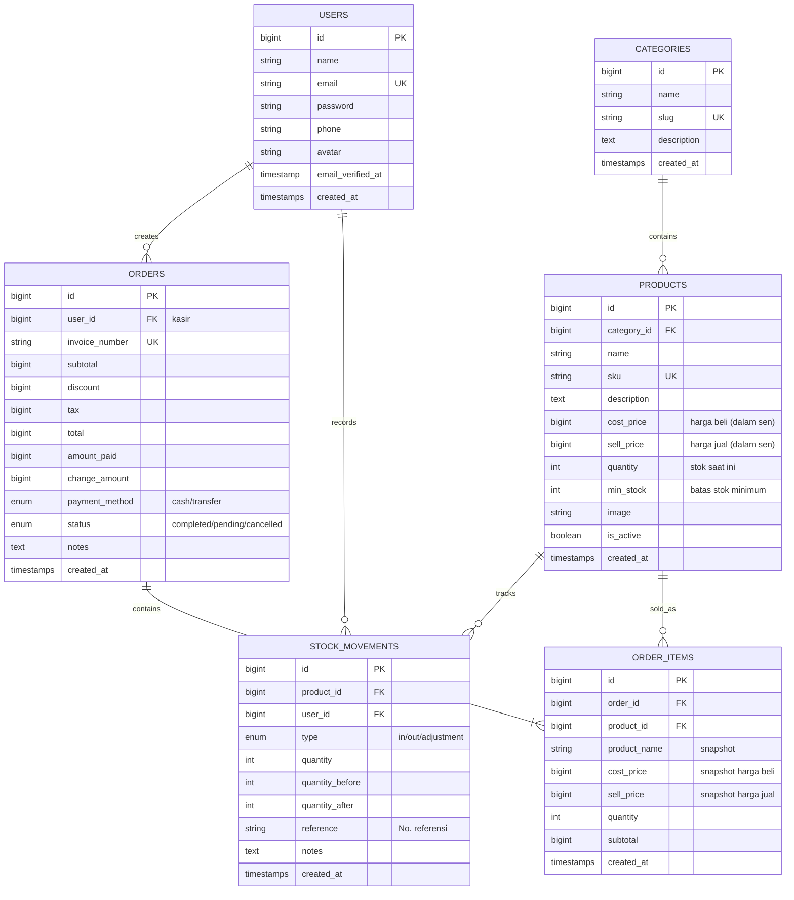

# ODOT ERP — Full Implementation Plan

Sistem ERP modern untuk manajemen inventaris, POS (kasir), dan analitik penjualan berbasis **Laravel 11 + Tailwind CSS + Alpine.js**.

## User Review Required

> [!IMPORTANT]
> **Database Engine**: Rencana ini menggunakan **MySQL** sebagai database utama (bukan SQLite default Laravel 11). Jika Anda ingin menggunakan database lain (PostgreSQL/SQLite), harap informasikan.

> [!IMPORTANT]
> **Spatie Permission**: Untuk RBAC, kita akan menggunakan package `spatie/laravel-permission` yang merupakan standar industri. Ini akan menambah beberapa tabel otomatis (`roles`, `permissions`, `model_has_roles`, dll.).

> [!WARNING]
> **Chatbot & Riset Pasar**: Fitur chatbot dan riset pasar di dashboard akan dimulai sebagai **mock/placeholder UI** dengan data dummy. Integrasi API nyata (OpenAI, Shopee API, dll.) akan ditambahkan di fase berikutnya jika diperlukan.

## Open Questions

1. **Metode Pembayaran**: Apakah cukup dengan Tunai & Transfer saja, atau perlu menambahkan QRIS/E-Wallet?
2. **Multi-Toko**: Apakah sistem ini untuk satu toko saja atau perlu mendukung multi-cabang?
3. **Mata Uang**: Apakah menggunakan Rupiah (IDR) saja?
4. **Cetak Struk**: Apakah menggunakan printer thermal (58mm/80mm) atau cetak ke PDF biasa?

---

## Proposed Changes

Proyek akan dibangun secara bertahap dalam **5 fase utama**.

---

### Fase 1: Inisialisasi Proyek & Arsitektur Database

#### [NEW] Laravel 11 Project Scaffold
- `composer create-project laravel/laravel .` di workspace `/Users/macbookpro/Codevits/odot`
- Install dependencies: `spatie/laravel-permission`, Tailwind CSS via Vite, Alpine.js
- Konfigurasi `.env` untuk MySQL

---

#### [NEW] Database Migrations (10 tabel utama)

Berikut Entity Relationship Diagram (ERD) lengkap:



> [!NOTE]
> **Harga disimpan dalam satuan terkecil (sen/cent)** untuk menghindari masalah floating-point. Rp 50.000 disimpan sebagai `5000000`. Accessor di Model akan mengonversi otomatis.

> [!NOTE]
> **Order Items menyimpan snapshot** nama barang dan harga saat transaksi, sehingga perubahan harga di masa depan tidak mengubah riwayat penjualan.

---

#### [NEW] Eloquent Models (6 model)

| Model | File | Relasi Utama |
|:---|:---|:---|
| `User` | `app/Models/User.php` | hasMany Orders, hasMany StockMovements, HasRoles (Spatie) |
| `Category` | `app/Models/Category.php` | hasMany Products |
| `Product` | `app/Models/Product.php` | belongsTo Category, hasMany OrderItems, hasMany StockMovements |
| `StockMovement` | `app/Models/StockMovement.php` | belongsTo Product, belongsTo User |
| `Order` | `app/Models/Order.php` | belongsTo User, hasMany OrderItems |
| `OrderItem` | `app/Models/OrderItem.php` | belongsTo Order, belongsTo Product |

Setiap model akan dilengkapi:
- `$fillable` yang ketat
- Accessor untuk konversi harga (sen → rupiah)
- Scope query (misalnya `Product::active()`, `Order::today()`)
- Cast yang tepat (`decimal`, `boolean`, `datetime`)

---

#### [NEW] Database Seeder

| Seeder | Deskripsi |
|:---|:---|
| `RolePermissionSeeder` | Membuat role Admin & Pemilik beserta permission |
| `UserSeeder` | Admin default + Pemilik demo |
| `CategorySeeder` | 5-8 kategori contoh |
| `ProductSeeder` | 20-30 produk contoh dengan data realistis |

---

### Fase 2: Autentikasi & RBAC

#### [MODIFY] `app/Models/User.php`
- Tambahkan trait `HasRoles` dari Spatie
- Tambahkan field `phone`, `avatar`

#### [NEW] `app/Http/Middleware/CheckRole.php`
- Middleware custom untuk redirect berdasarkan role

#### [NEW] `app/Http/Controllers/Auth/` (Login, Register, Profile)
- Register hanya untuk Admin yang membuat user baru
- Login dengan email + password
- Profile update (nama, foto, password)

#### [NEW] `app/Http/Controllers/UserManagementController.php`
- CRUD user (hanya Admin)
- Assign/change role

#### [NEW] Views Auth
- `resources/views/auth/login.blade.php`
- `resources/views/auth/register.blade.php`
- `resources/views/profile/edit.blade.php`
- `resources/views/users/index.blade.php` (admin only)

---

### Fase 3: Layout & Welcome Dashboard

#### [NEW] `resources/views/layouts/app.blade.php`
Layout utama dengan:
- **Sidebar** (navigasi menu, collapsible, responsif)
- **Topbar** (profil, notifikasi, nama user)
- **Content Area** (slot Blade)

**Tema Warna:**
```
Primary:    #4F7DF3 (Soft Blue)
Secondary:  #7C5CFC (Soft Purple)
Accent:     #00C9A7 (Mint Green)
Background: #F8FAFC (Light Gray)
Surface:    #FFFFFF (White)
Text:       #1E293B (Slate 800)
Muted:      #94A3B8 (Slate 400)
```

#### [NEW] `resources/views/dashboard.blade.php`
Dashboard interaktif berisi:

| Widget | Deskripsi |
|:---|:---|
| **Summary Cards** | 4 kartu: Total Produk, Stok Rendah, Penjualan Hari Ini, Pendapatan Hari Ini |
| **Grafik Penjualan** | Chart.js — penjualan 7 hari terakhir |
| **Produk Terlaris** | Top 5 produk berdasarkan quantity sold |
| **Riset Pasar** | Widget sidebar dengan mock data tren produk marketplace |
| **Chatbot** | Floating button di kanan bawah, membuka panel chat |

---

### Fase 4: Manajemen Inventaris

#### [NEW] `app/Http/Controllers/CategoryController.php`
- CRUD kategori

#### [NEW] `app/Http/Controllers/ProductController.php`
- CRUD produk + upload gambar
- Filter & search
- Auto-generate SKU

#### [NEW] `app/Http/Controllers/StockMovementController.php`
- Catat barang masuk/keluar
- Otomatis update quantity di products

#### [NEW] Views Inventory
- `resources/views/categories/index.blade.php`
- `resources/views/products/index.blade.php`
- `resources/views/products/create.blade.php`
- `resources/views/products/edit.blade.php`
- `resources/views/stock-movements/index.blade.php`

---

### Fase 5: POS (Kasir) & Statistik

#### [NEW] `app/Http/Controllers/PosController.php`
- Halaman kasir full-interaktif (Alpine.js)
- Logika keranjang belanja (add, remove, update qty)
- Hitung subtotal, diskon, pajak, total otomatis
- Proses pembayaran → simpan Order + OrderItems
- Auto-kurangi stok produk
- Generate invoice number

#### [NEW] `app/Http/Controllers/ReportController.php`
- Laporan penjualan harian/mingguan/bulanan
- Produk terlaris (best-selling)
- Kalkulasi profit kotor (sell_price - cost_price)
- Export data (opsional)

#### [NEW] Views POS & Reports
- `resources/views/pos/index.blade.php` — UI kasir responsif
- `resources/views/pos/receipt.blade.php` — Template struk cetak
- `resources/views/reports/index.blade.php` — Dashboard statistik + Chart.js

---

## Verification Plan

### Automated Tests
```bash
# Pastikan aplikasi bisa di-boot
php artisan serve

# Jalankan migrasi dan seeder
php artisan migrate:fresh --seed

# Verifikasi route
php artisan route:list

# Jalankan test suite
php artisan test
```

### Manual Verification
- Login sebagai Admin → bisa CRUD user, tidak bisa akses POS
- Login sebagai Pemilik → bisa akses Stock, POS, Statistik
- Tambah produk → muncul di halaman stok
- Proses transaksi di POS → stok berkurang, order tersimpan
- Dashboard menampilkan data real-time dari transaksi
- Responsif di mobile dan desktop
